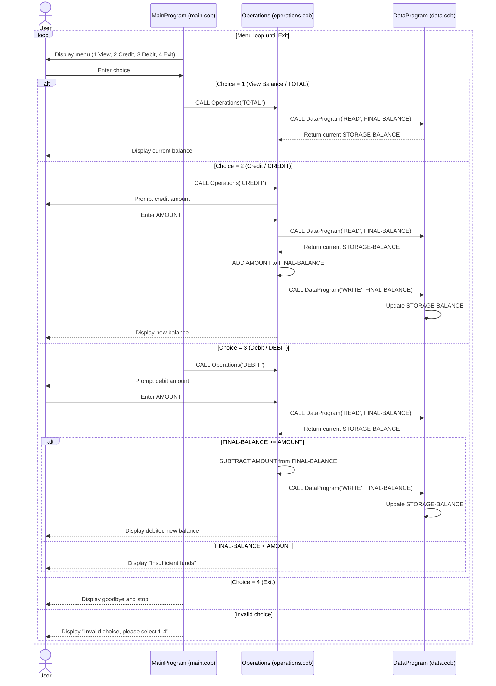

# Student Account COBOL Documentation

This document explains the purpose of each COBOL file in the project, the key processing logic, and the business rules currently implemented for student accounts.

## File Overview

### 1) [src/cobol/main.cob](src/cobol/main.cob)

Purpose:
- Entry point and user interface loop for the account management workflow.
- Presents a command menu and routes user actions to the operations program.

Key logic:
- Displays a menu with 4 options:
  - View Balance
  - Credit Account
  - Debit Account
  - Exit
- Accepts a numeric menu choice from the user.
- Calls [src/cobol/operations.cob](src/cobol/operations.cob) with one of these operation codes:
  - TOTAL  (view balance)
  - CREDIT (credit/add funds)
  - DEBIT  (debit/remove funds)
- Keeps looping until the user selects Exit.

### 2) [src/cobol/operations.cob](src/cobol/operations.cob)

Purpose:
- Implements account transaction behavior for balance inquiry, credits, and debits.
- Acts as the business logic layer between the menu and data storage.

Key logic:
- Receives an operation code from MainProgram.
- For TOTAL:
  - Reads current balance from DataProgram.
  - Displays current balance.
- For CREDIT:
  - Prompts for amount.
  - Reads current balance.
  - Adds credit amount.
  - Writes updated balance.
  - Displays new balance.
- For DEBIT:
  - Prompts for amount.
  - Reads current balance.
  - Validates available funds.
  - Subtracts amount and writes updated balance when funds are sufficient.
  - Displays an insufficient-funds message otherwise.

### 3) [src/cobol/data.cob](src/cobol/data.cob)

Purpose:
- Centralized storage and retrieval for the account balance used by operations.
- Provides a simple read/write interface through operation flags.

Key logic:
- Maintains internal STORAGE-BALANCE (initialized to 1000.00).
- Accepts operation type through linkage:
  - READ  -> copies stored balance out to caller.
  - WRITE -> updates stored balance from caller input.

## Student Account Business Rules

The current implementation enforces these rules:

1. Starting balance:
- Student account begins at 1000.00 by default.

2. Valid transaction types:
- Only three account operations are supported:
  - View balance (TOTAL)
  - Credit (CREDIT)
  - Debit (DEBIT)

3. Debit protection:
- A debit is only allowed if current balance is greater than or equal to the requested debit amount.
- If not, transaction is rejected with an insufficient-funds message.

4. Persisted balance during runtime:
- Balance updates are written through DataProgram and used by subsequent operations while program session is active.

5. Menu validation:
- Menu choices outside 1-4 are rejected with an invalid-choice message.

## Program Interaction Flow

1. User selects an action in MainProgram.
2. MainProgram calls Operations with an operation code.
3. Operations calls DataProgram to READ and/or WRITE balance.
4. Operations returns status/output to user.
5. Control returns to MainProgram loop until Exit.

## Notes for Future Modernization

Potential improvements for student account handling:
- Add transaction history (timestamp, type, amount, resulting balance).
- Add input validation for negative or zero amounts.
- Persist data beyond runtime (file or database storage).
- Add student account identifiers to support multiple students.
- Add configurable business limits (daily debit limit, minimum balance threshold).

## Sequence Diagram (Mermaid)

